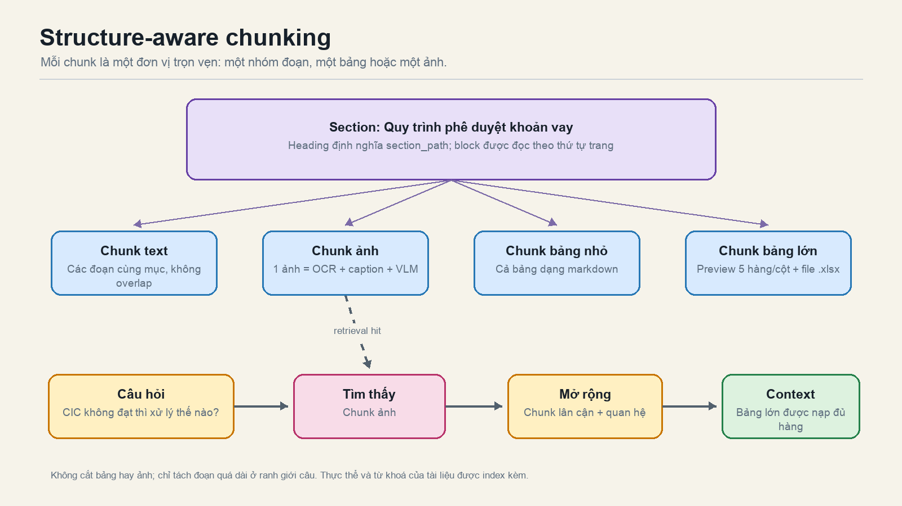

# Luồng xử lý dữ liệu thực tế

Tài liệu này mô tả **những gì code đang làm** (đối chiếu với `rag_kaggle/`), từng bước, cho text, bảng và hình.
`Architecture.md` mô tả thiết kế mục tiêu; các phần Parent-child trong đó đã được thay bằng
chunking theo cấu trúc như bên dưới.

## 1. Trích xuất (`parsers.py`, `ocr_correction.py`, `vision.py`)

| Loại | Cách lấy | Ghi chú |
|---|---|---|
| Text PDF/DOCX | PyMuPDF / python-docx, heading theo font hoặc style | `section_path` gắn vào từng block |
| Scan PDF, ảnh | PaddleOCR-VL (GPU 1, process riêng) → block theo layout label | Text OCR đi qua bước sửa chính tả |
| Bảng | `metadata["rows"]` (list hàng × ô) + `content` markdown | Excel giữ `cell_range`, formula, hidden rows |
| Hình/chart | OCR text + caption; chart/flowchart có thêm block VLM | VLM chạy **sau** khi sửa OCR của cả document |

**Sửa chính tả OCR** (GPU 0, `OCRCorrectionCoordinator`): worker tuần tự, mỗi request chỉ gồm
system + skill + (glossary) + đuôi `previous_context_chars` của đoạn liền trước đã sửa + một đoạn
`segment_chars` của đoạn hiện tại. Đoạn dài được chia theo câu; bảng được sửa theo hàng với kiểm tra
số hàng/số ô. Output không hợp lệ (JSON sai, đổi số/mã/URL, đổi cấu trúc bảng) → giữ nguyên bản OCR thô.
Heading đã sửa được ghi ngược vào `section_path` của mọi block con.

**VLM**: chỉ cho chart/flowchart, nhận OCR text đã sửa và phần cuối **đúng một trang** liền trước
(`vision.previous_page_chars`), không cộng dồn. Block mô tả được chèn ngay sau ảnh trong reading order.

## 2. Hồ sơ tài liệu (`profile.py`, `entities.py`)

Sau parse và `build_relationships`, `build_document_profile` tạo (không dùng LLM):
`title`, `doc_number`, `issue_date`, `issuer`, `signers`, `keywords`, `entities` (person / location /
other, kèm biến thể chính tả). Hồ sơ được lưu trong `documents.payload_json`, bảng `document_entities`,
`document_keywords`, và gắn vào từng chunk (`entities` mà chunk thực sự nhắc tới + `keywords`).

## 3. Chunking (`chunking.py`, `StructureAwareChunker`)

Một chunk là đúng một trong:

- **Text**: các đoạn liên tiếp cùng `section_path` gộp tới `text_chunk_chars`; không overlap. Một đoạn
  quá dài mới bị cắt, ở ranh giới câu/bullet.
- **Bảng**: luôn 1 chunk. Vừa `table_inline_max_chars` → cả bảng dạng markdown (kèm tiêu đề, header kế thừa
  từ trang trước, câu tham chiếu). Quá lớn → *preview* (header + `table_preview_rows` hàng +
  `table_preview_columns` cột đầu + danh sách tên cột) và bảng đầy đủ lưu `tables/<document_id>/<block_id>.xlsx`
  (`metadata.table_file`).
- **Ảnh/chart/flowchart/KPI**: 1 chunk = OCR text + caption + câu tham chiếu (chỉ cắt khi vượt `visual_max_chars`).

Mỗi chunk chỉ embed một header ngắn (`Section`, `Sheet`, `Range`); tên file, trang, loại nội dung nằm trong
metadata/payload, không nằm trong text được embed.

## 4. Embedding và lưu trữ (`storage.py`)

| Nơi | Nội dung |
|---|---|
| Qdrant (`dense`) | vector BGE-M3 của `chunk.content`; payload: id, loại, section, trang, sheet, `entities`, `keywords`, `doc_title`, `doc_number`, `issue_date`, `signers`, `table_file` |
| BM25 (`bm25.pkl`) | `bm25_text`: nội dung + tên file + tiêu đề + entities (có cả bản không dấu) + keywords |
| SQLite | `documents`, `blocks` (bảng đầy đủ), `chunks` (có `ordinal`, `section_key`), `relationships`, `document_entities`, `document_keywords` |
| Parquet / xlsx | bảng cho tính toán có cấu trúc / bảng lớn cho người dùng tải |

Schema corpus: `ARTIFACT_SCHEMA_VERSION = 2`. DB cũ (parent-child) bị từ chối với thông báo rõ ràng; cần ingest lại.

## 5. Truy xuất (`retrieval.py`, `pipeline.ask`)

1. Query (và biến thể nếu bật rewrite) → dense + BM25.
2. `match_entities`: thực thể trong câu hỏi khớp với `document_entities` (không phân biệt dấu/hoa thường)
   → thêm một cặp ranking dense + sparse giới hạn trong các tài liệu đó. Đây là *boost mềm* qua RRF, không phải filter.
3. RRF → reranker → top-k.
4. `expand_context`: chunk trúng; với chunk text thêm `neighbor_chunks` kề nhau cùng section; bảng preview được nạp
   lại **đủ hàng** (tối đa `max_table_chars_in_context`); thêm block liên quan qua `relationships`.
5. Prompt có thêm tiêu đề, số hiệu, ngày, người ký của tài liệu và đường dẫn file bảng đầy đủ; `compute_from_blocks`
   tính trên `rows` đầy đủ của block, không phụ thuộc preview.
